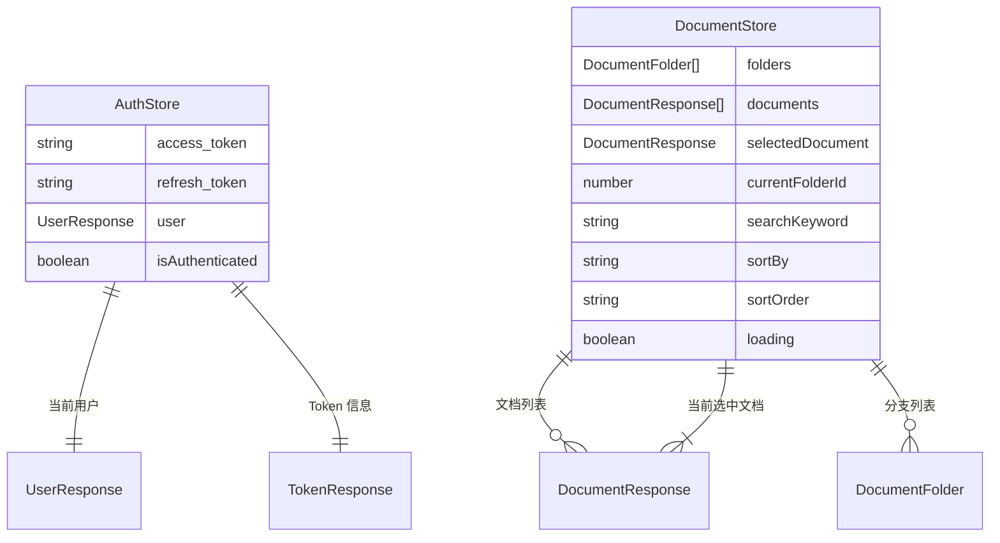
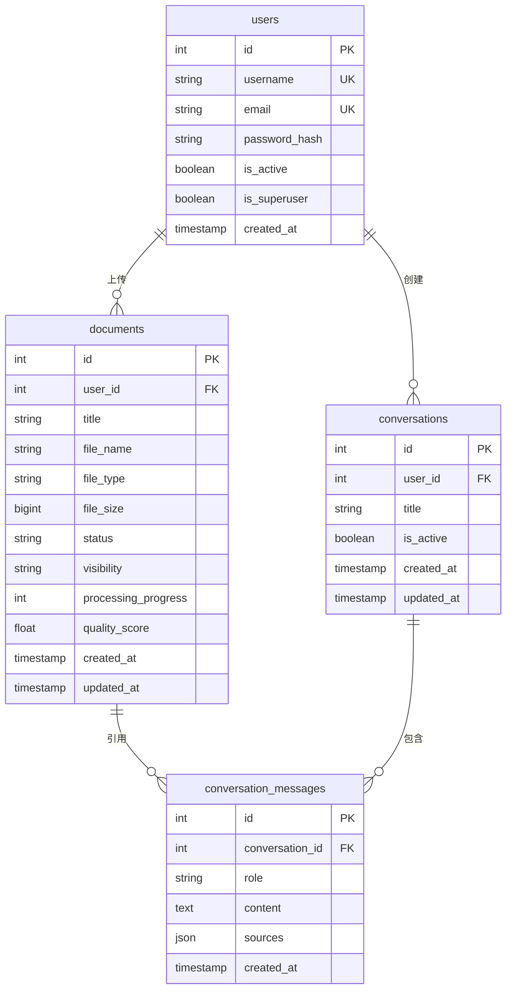
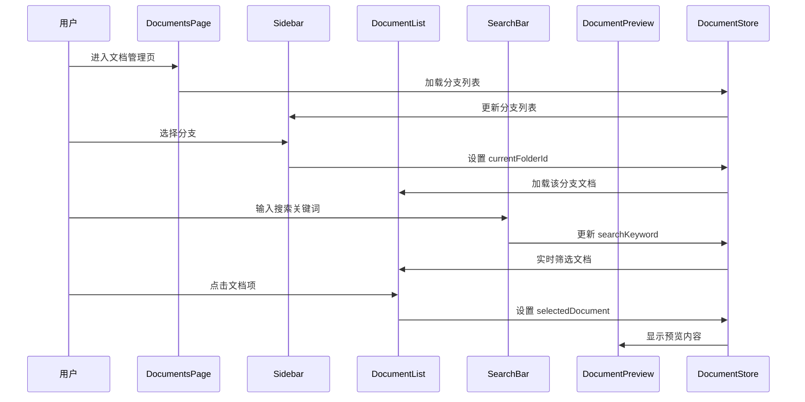

# 技术架构文档 - GeiIt企业知识库前端

## 1. 架构设计

本系统采用前后端分离架构，前端为 React SPA 单页应用，通过 HTTP/SSE 与已有 FastAPI 后端通信。前端负责界面渲染、用户交互、状态管理和路由控制；后端负责业务逻辑、数据持久化、文档处理和 LLM 问答。

```mermaid
flowchart TB
    subgraph "前端层 (React SPA)"
        "路由层 (React Router)"
        "页面层 (Pages)"
        "组件层 (Components)"
        "状态层 (Zustand Store)"
        "API 客户端 (fetch 封装)"
    end

    subgraph "后端层 (FastAPI)"
        "API 路由 (Routers)"
        "业务服务 (Services)"
        "数据访问 (CRUD)"
        "认证中间件 (JWT)"
    end

    subgraph "数据层"
        "PostgreSQL + pgvector"
        "Redis 缓存"
    end

    subgraph "外部服务"
        "LLM 服务"
        "Celery 异步任务"
        "邮件服务"
    end

    "路由层" --> "页面层"
    "页面层" --> "组件层"
    "页面层" --> "状态层"
    "状态层" --> "API 客户端"
    "API 客户端" -->|"HTTP / SSE"| "API 路由"
    "API 路由" --> "认证中间件"
    "认证中间件" --> "业务服务"
    "业务服务" --> "数据访问"
    "数据访问" --> "PostgreSQL + pgvector"
    "业务服务" --> "Redis 缓存"
    "业务服务" --> "Celery 异步任务"
    "Celery 异步任务" --> "LLM 服务"
    "业务服务" --> "邮件服务"
```

### 1.1 前端分层职责

| 层级 | 目录 | 职责 |
|------|------|------|
| 路由层 | `src/App.tsx` | 定义路由表、路由守卫、布局组件嵌套 |
| 页面层 | `src/pages/` | 页面级组件，组合功能模块，管理页面状态 |
| 组件层 | `src/components/` | 可复用 UI 组件，单一职责，无业务逻辑 |
| 状态层 | `src/store/` | Zustand store，管理全局状态（用户、文档、分支） |
| API 层 | `src/api/` | HTTP 请求封装、接口定义、Token 拦截器 |
| 类型层 | `src/types/` | TypeScript 接口定义，对齐后端 Schema |
| 工具层 | `src/utils/` | 工具函数（格式化、校验、常量） |
| 钩子层 | `src/hooks/` | 自定义 React Hook，封装可复用逻辑 |

## 2. 技术描述

- **前端框架**: React@18 + TypeScript（类型安全，组件化开发）
- **构建工具**: Vite（快速 HMR，ESBuild 预构建）
- **样式方案**: tailwindcss@3（原子化 CSS，设计系统统一）
- **状态管理**: zustand（轻量级全局状态，避免 Provider 嵌套）
- **路由库**: react-router-dom@6（声明式路由，嵌套布局）
- **图标库**: lucide-react（简洁线性图标，符合 Claude Code 风格）
- **初始化工具**: vite-init（`react-ts` 模板）
- **HTTP 请求**: 原生 fetch API + 自定义封装（请求/响应拦截、Token 自动刷新、错误统一处理）
- **后端**: FastAPI（已有，无需新建）
- **数据库**: PostgreSQL + pgvector（已有，前端不直接访问）

## 3. 路由定义

| 路由 | 页面组件 | 用途 | 访问控制 |
|------|----------|------|----------|
| `/login` | LoginPage | 邮箱+密码登录 | 公开 |
| `/register` | RegisterApplyPage | 提交注册申请 | 公开 |
| `/set-password` | SetPasswordPage | 通过邮件链接设置密码 | 公开（需 token 参数） |
| `/documents` | DocumentsPage | 文档管理主页面（含侧边栏+列表+预览） | 需登录 |
| `/documents/:folderId` | DocumentsPage | 指定文档库分支下的文档列表 | 需登录 |
| `*` | NotFoundPage | 404 页面 | 公开 |

### 3.1 路由守卫设计

- **未登录访问受保护路由**: 重定向至 `/login`，并记录原目标路径用于登录后跳回
- **已登录访问公开路由** (`/login`, `/register`): 重定向至 `/documents`
- **Token 过期**: API 返回 401 时，自动尝试用 refresh_token 刷新，失败则跳转登录

## 4. API 定义

### 4.1 认证相关类型

```typescript
/** 用户登录请求（对齐后端 UserLogin Schema） */
interface LoginRequest {
  username: string;  // 后端使用 username 字段，前端将邮箱作为 username 传入
  password: string;
}

/** Token 响应（对齐后端 TokenResponse Schema） */
interface TokenResponse {
  access_token: string;
  refresh_token: string;
  token_type: string;
  expires_in: number;
  user: UserResponse;
}

/** 用户信息（对齐后端 UserResponse Schema） */
interface UserResponse {
  id: number;
  username: string;
  email: string;
  is_active: boolean;
  is_superuser: boolean;
  created_at: string;  // ISO 8601 时间字符串
}

/** 刷新 Token 请求 */
interface RefreshTokenRequest {
  refresh_token: string;
}

/** 注册申请请求（需后端新增接口） */
interface RegisterApplyRequest {
  email: string;
  username: string;
}

/** 注册申请状态 */
type ApplicationStatus = 'pending' | 'approved' | 'rejected';

/** 设置密码请求（需后端新增接口） */
interface SetPasswordRequest {
  token: string;
  password: string;
}
```

### 4.2 文档相关类型

```typescript
/** 文档处理状态 */
type DocumentStatus = 'pending' | 'processing' | 'completed' | 'failed' | 'low_quality';

/** 文档可见性 */
type DocumentVisibility = 'private' | 'public';

/** 文档信息（对齐后端 DocumentResponse Schema） */
interface DocumentResponse {
  id: number;
  title: string;
  file_name: string;
  file_type: string;
  file_size: number;
  status: DocumentStatus;
  visibility: DocumentVisibility;
  processing_step: string | null;
  processing_progress: number;  // 0-100
  quality_score: number | null;
  quality_issues: string[] | null;
  chunk_count: number;
  total_tokens: number;
  task_id: string | null;
  error_message: string | null;
  created_at: string;
  updated_at: string;
}

/** 文档列表响应（分页） */
interface DocumentListResponse {
  items: DocumentResponse[];
  total: number;
  page: number;
  page_size: number;
}

/** 文档列表查询参数 */
interface DocumentQueryParams {
  page?: number;
  page_size?: number;
  status?: DocumentStatus;
  search?: string;        // 文件名模糊搜索
  sort_by?: 'created_at' | 'updated_at' | 'file_name' | 'file_type';
  sort_order?: 'asc' | 'desc';
  folder_id?: number;     // 文档库分支筛选
}

/** 上传文档请求（multipart/form-data） */
interface UploadDocumentParams {
  file: File;
  title?: string;        // 可选，不填用文件名
  category?: string;     // 默认 "other"
  visibility?: DocumentVisibility;  // 默认 "private"
  folder_id?: number;    // 所属分支
}

/** 任务状态响应 */
interface TaskStatusResponse {
  task_id: string;
  status: 'PENDING' | 'STARTED' | 'SUCCESS' | 'FAILURE' | 'RETRY';
  progress: number;
  result: unknown | null;
  error: string | null;
}
```

### 4.3 文档库分支类型（需后端新增接口）

```typescript
/** 文档库分支 */
interface DocumentFolder {
  id: number;
  name: string;
  document_count: number;
  created_at: string;
  updated_at: string;
}

/** 创建分支请求 */
interface CreateFolderRequest {
  name: string;
}

/** 更新分支请求 */
interface UpdateFolderRequest {
  name?: string;
}
```

### 4.4 API 客户端封装

```typescript
/** API 客户端核心封装
 * 作用：统一管理 HTTP 请求，处理 Token 注入、自动刷新、错误处理
 */
class ApiClient {
  private baseUrl: string;
  private accessToken: string | null;

  /** 通用请求方法
   * @param endpoint - API 路径（不含 baseUrl）
   * @param options - fetch 配置
   * @returns 响应数据
   */
  async request<T>(endpoint: string, options?: RequestInit): Promise<T>;

  /** 自动刷新 Token 的请求封装
   * 作用：401 时自动调用 refresh，重试原请求
   */
  private async requestWithRefresh<T>(endpoint: string, options?: RequestInit): Promise<T>;

  /** SSE 流式请求（用于问答流式响应） */
  async streamRequest(endpoint: string, body: unknown): Promise<ReadableStream>;
}
```

## 5. 服务端架构图

后端已有 FastAPI 架构，前端通过 API 对接，无需修改后端。服务端架构如下供参考：

```mermaid
flowchart LR
    subgraph "API 层"
        "Auth Router"
        "Document Router"
        "Chat Router"
    end

    subgraph "服务层"
        "AuthService"
        "DocumentService"
        "QAService"
        "PermissionService"
    end

    subgraph "数据层"
        "UserRepository"
        "DocumentRepository"
        "ConversationRepository"
    end

    "Auth Router" --> "AuthService"
    "Document Router" --> "DocumentService"
    "Chat Router" --> "QAService"

    "AuthService" --> "UserRepository"
    "DocumentService" --> "DocumentRepository"
    "DocumentService" --> "PermissionService"
    "QAService" --> "DocumentRepository"
    "QAService" --> "ConversationRepository"

    "UserRepository" --> "PostgreSQL"
    "DocumentRepository" --> "PostgreSQL"
    "DocumentRepository" --> "Redis"
```

## 6. 数据模型

### 6.1 前端状态模型（Zustand Store）

前端不直接操作数据库，状态模型用于管理应用运行时状态：



### 6.2 后端数据模型（参考，前端不直接访问）

后端已有 PostgreSQL 数据库，包含以下核心表：



## 7. 组件层级设计

### 7.1 页面组件结构

```
src/
├── pages/
│   ├── LoginPage.tsx              # 登录页
│   ├── RegisterApplyPage.tsx      # 注册申请页
│   ├── SetPasswordPage.tsx        # 密码设置页
│   ├── DocumentsPage.tsx          # 文档管理主页面
│   └── NotFoundPage.tsx           # 404 页面
├── components/
│   ├── auth/
│   │   ├── LoginForm.tsx          # 登录表单
│   │   ├── RegisterApplyForm.tsx  # 注册申请表单
│   │   ├── SetPasswordForm.tsx    # 密码设置表单
│   │   └── PasswordStrength.tsx   # 密码强度指示器
│   ├── documents/
│   │   ├── Sidebar.tsx            # 文档库分支侧边栏
│   │   ├── FolderList.tsx         # 分支列表
│   │   ├── FolderItem.tsx         # 单个分支项
│   │   ├── CreateFolderModal.tsx  # 新建分支弹窗
│   │   ├── UploadZone.tsx         # 拖拽+点击上传区
│   │   ├── DocumentList.tsx       # 文档列表
│   │   ├── DocumentItem.tsx       # 单个文档项
│   │   ├── SearchBar.tsx          # 搜索框
│   │   ├── SortDropdown.tsx       # 排序下拉
│   │   └── DocumentPreview.tsx    # 文档预览面板
│   └── common/
│       ├── Button.tsx             # 按钮组件
│       ├── Input.tsx              # 输入框组件
│       ├── Modal.tsx              # 弹窗组件
│       ├── Badge.tsx              # 徽章组件
│       ├── Spinner.tsx            # 加载指示器
│       ├── Skeleton.tsx           # 骨架屏
│       ├── EmptyState.tsx         # 空状态
│       └── ErrorState.tsx         # 错误状态
├── store/
│   ├── authStore.ts               # 认证状态
│   └── documentStore.ts           # 文档状态
├── api/
│   ├── client.ts                  # API 客户端封装
│   ├── auth.ts                    # 认证接口
│   └── document.ts                # 文档接口
├── types/
│   ├── user.ts                    # 用户类型
│   ├── document.ts                # 文档类型
│   └── api.ts                     # API 通用类型
├── hooks/
│   ├── useAuth.ts                 # 认证 Hook
│   ├── useDocuments.ts            # 文档列表 Hook
│   └── useUpload.ts               # 上传 Hook
└── utils/
    ├── format.ts                  # 格式化工具
    ├── validate.ts                # 校验工具
    └── constants.ts               # 常量定义
```

### 7.2 关键组件交互流程



## 8. 设计系统规范

### 8.1 色彩系统（Tailwind 配置扩展）

```javascript
// tailwind.config.js 颜色扩展
colors: {
  // Claude Code 风格色彩
  'bg-base': '#FAFAF9',      // 暖白背景
  'bg-surface': '#FFFFFF',   // 卡片表面
  'bg-hover': '#F5F5F4',     // hover 背景
  'border-default': '#E5E5E4', // 边框
  'text-primary': '#1A1A1A',   // 主文字
  'text-secondary': '#71717A', // 次文字
  'text-tertiary': '#A1A1AA',  // 三级文字
  'accent': '#D97757',        // 橙色强调
  'accent-hover': '#C26547',  // 强调 hover
  'success': '#16A34A',       // 成功
  'warning': '#D97706',       // 警告
  'error': '#DC2626',         // 错误
}
```

### 8.2 字体规范

- **字体栈**: `-apple-system, "Segoe UI", "Noto Sans SC", sans-serif`
- **字号层级**:
  - `text-2xl` (24px) - 页面标题
  - `text-lg` (18px) - 区块标题
  - `text-base` (16px) - 正文
  - `text-sm` (14px) - 次要文字
  - `text-xs` (12px) - 标注/徽章

### 8.3 间距规范

- 所有 padding/margin 使用 4 的倍数（`p-2`, `p-4`, `p-6`, `p-8`）
- 组件间距统一使用 `gap-4`（16px）或 `gap-6`（24px）
- 卡片圆角统一 `rounded-lg`（8px）
- 按钮圆角统一 `rounded-lg`

## 9. 错误处理与加载策略

### 9.1 错误处理

- **网络错误**: 显示全局 Toast 提示，提供重试按钮
- **401 未授权**: 自动尝试刷新 Token，失败跳转登录
- **403 无权限**: 显示无权限提示卡片
- **404 资源不存在**: 显示空状态
- **500 服务器错误**: 显示错误状态卡片 + 重试按钮
- **表单错误**: 字段下方红色文字提示

### 9.2 加载策略

- **页面加载**: 骨架屏（Skeleton）占位，避免布局抖动
- **按钮提交**: 显示 Spinner，禁用按钮防重复提交
- **文档列表**: 首屏骨架屏，滚动加载更多
- **上传进度**: 实时进度条 + 百分比显示
- **文档预览**: 加载中显示 Spinner 居中

## 10. 项目初始化与部署

### 10.1 项目位置

```
kb_qa_system/
├── backend/          # 已有后端
└── frontend/         # 前端项目（待创建）
    ├── src/
    ├── public/
    ├── package.json
    ├── tsconfig.json
    ├── vite.config.ts
    ├── tailwind.config.js
    └── postcss.config.js
```

### 10.2 环境变量

```bash
# .env.local
VITE_API_BASE_URL=http://localhost:8000/api/v1  # 后端 API 地址
VITE_APP_TITLE=GeiIt企业知识库                    # 应用标题
```

### 10.3 开发与构建命令

- `npm run dev` - 启动开发服务器（HMR）
- `npm run build` - 生产构建
- `npm run preview` - 预览生产构建
- `npm run check` - TypeScript 类型检查

### 10.4 部署说明

- 前端独立部署至 Vercel
- 后端部署至 Railway（已有）
- 生产环境需配置 CORS 允许前端域名
- API 地址通过环境变量注入，支持开发/生产切换
