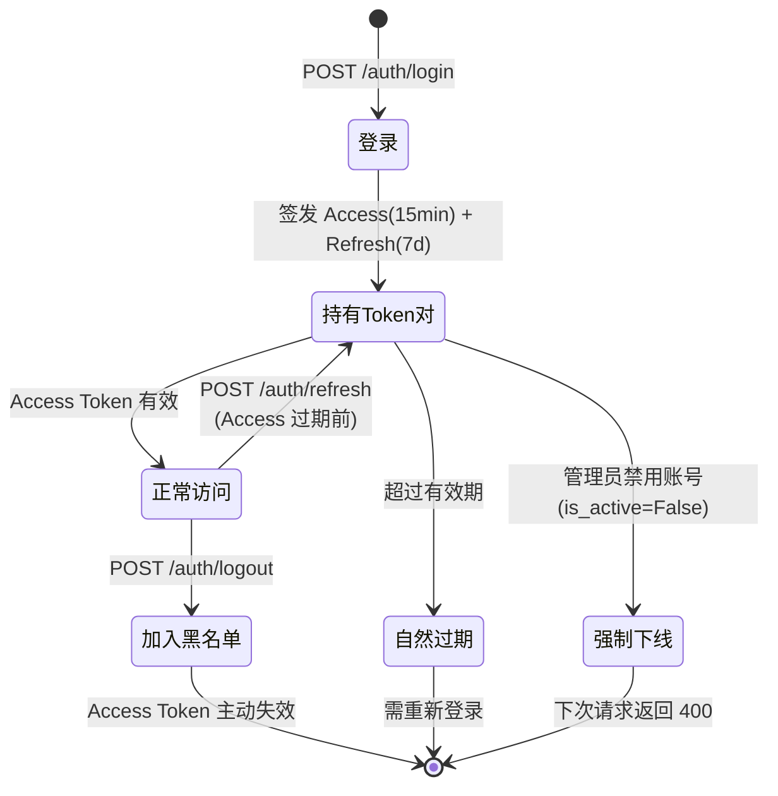
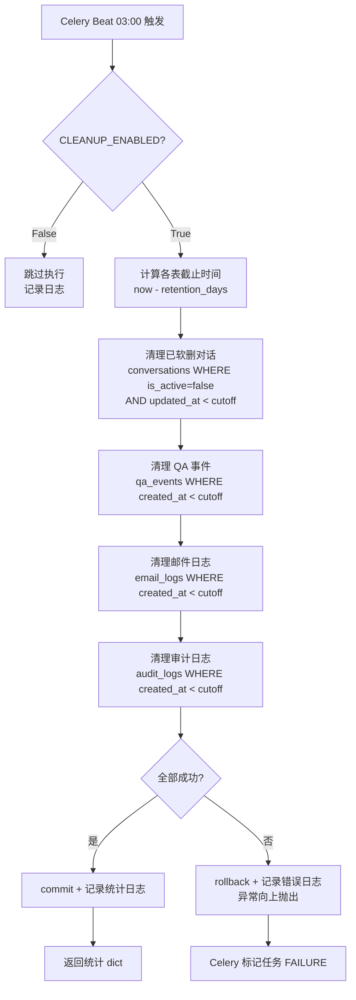
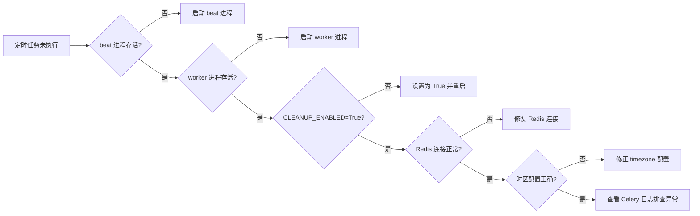
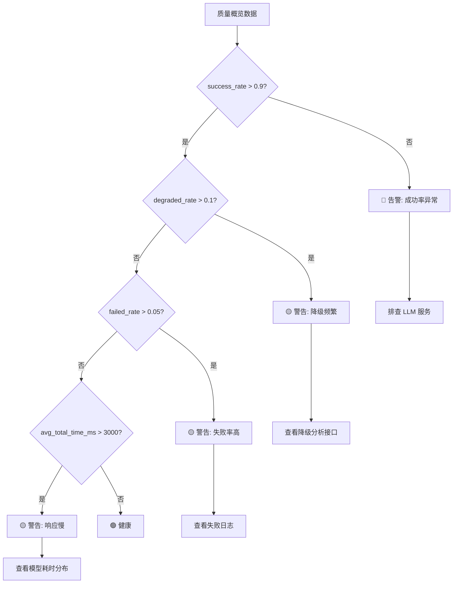
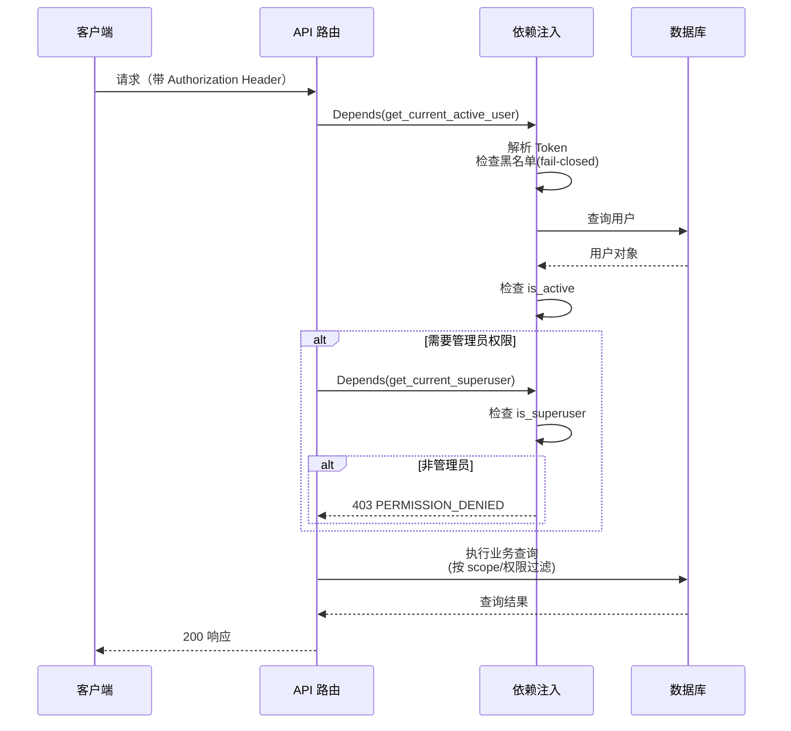
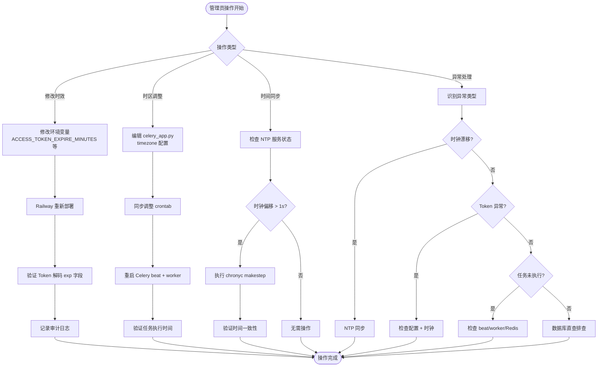
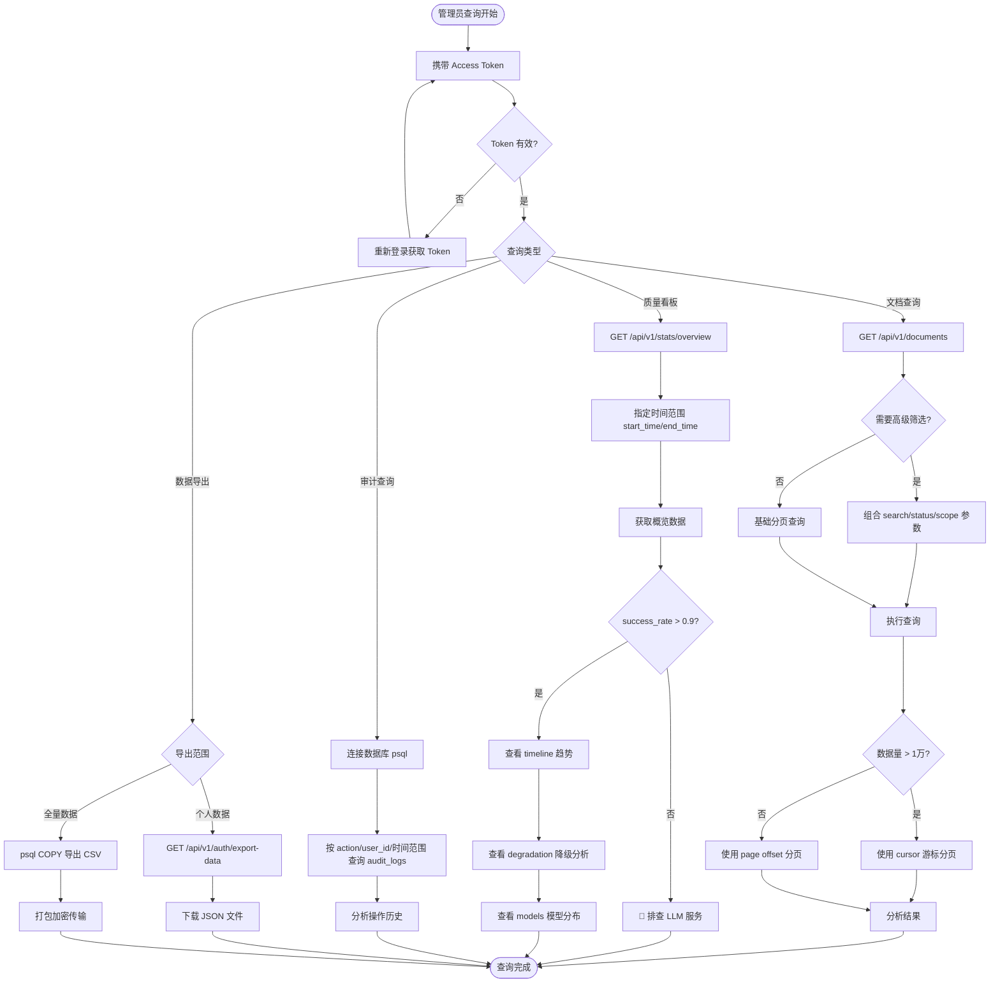

# GeiIt 企业知识库 — 管理员与运维操作文档

> **文档版本**：v1.0  
> **适用对象**：系统管理员（superuser）、运维工程师  
> **最后更新**：2026-07-11  
> **配套系统**：GeiIt 企业知识库问答系统（后端 `kb_qa_system/backend`，前端 `kb_qa_system/frontend`）

---

## 目录

- [1. 概述](#1-概述)
- [2. 时间管理模块](#2-时间管理模块)
  - [2.1 系统时区与时间基准](#21-系统时区与时间基准)
  - [2.2 时间相关配置项清单](#22-时间相关配置项清单)
  - [2.3 时间设置操作步骤](#23-时间设置操作步骤)
  - [2.4 时区调整操作](#24-时区调整操作)
  - [2.5 时间同步机制](#25-时间同步机制)
  - [2.6 Token 与会话时效管理](#26-token-与会话时效管理)
  - [2.7 定时任务调度（Celery Beat）](#27-定时任务调度celery-beat)
  - [2.8 异常时间处理方案](#28-异常时间处理方案)
- [3. 数据查询功能](#3-数据查询功能)
  - [3.1 查询功能总览](#31-查询功能总览)
  - [3.2 文档基础查询](#32-文档基础查询)
  - [3.3 文档高级筛选](#33-文档高级筛选)
  - [3.4 对话历史查询](#34-对话历史查询)
  - [3.5 质量看板统计查询](#35-质量看板统计查询)
  - [3.6 文档统计概览](#36-文档统计概览)
  - [3.7 审计日志查询](#37-审计日志查询)
  - [3.8 批量数据导出](#38-批量数据导出)
  - [3.9 查询结果分析](#39-查询结果分析)
- [4. 操作权限说明](#4-操作权限说明)
- [5. 安全注意事项](#5-安全注意事项)
- [6. 常见问题排查与解决](#6-常见问题排查与解决)
- [7. 操作流程图](#7-操作流程图)
- [附录 A：环境变量速查表](#附录-a环境变量速查表)

---

## 1. 概述

本文档面向 **GeiIt 企业知识库问答系统** 的管理员与运维人员，详细说明系统中**时间相关操作**与**数据查询功能**的完整处理流程。文档内容基于系统实际代码编写，所有接口参数、配置项、权限逻辑均与生产代码保持一致。

**前置条件**：

| 项目 | 要求 |
|------|------|
| 管理员账号 | 通过 `scripts/create_superuser.py` 创建，`is_superuser=True` |
| 系统访问权限 | 能登录前端管理后台或调用后端 API |
| 工具准备 | `curl` / Postman（API 调试用）、`psql`（数据库直查）、`redis-cli`（缓存检查） |
| 部署环境 | Railway 生产环境 或 本地 Docker Compose 开发环境 |

**核心术语**：

- **超级管理员（superuser）**：`users.is_superuser=True` 的账号，拥有系统全部权限
- **公共文档库**：`documents.visibility='public'`，所有登录用户可见可检索
- **个人文档库**：`documents.visibility='private'`，仅上传者和超管可见
- **软删除**：`documents.is_deleted=True`，对用户不可见但数据库保留
- **降级**：主服务不可用时自动切换备用提供者，记录 `is_degraded=True`。系统包含两类降级链路：
  - **LLM 降级**：`primary`（主模型） → `fallback`（降级模型） → `local_fallback`（本地 Ollama）
  - **Embedding 降级**：`primary`（主模型） → `cloud_fallback`（云端备用，如阿里云） → `local_fallback`（HuggingFace 本地）

---

## 2. 时间管理模块

### 2.1 系统时区与时间基准

系统采用**双时间基准**设计，确保时间处理的一致性与可追溯性：

| 组件 | 时间基准 | 时区 | 说明 |
|------|----------|------|------|
| 应用层（JWT Token） | UTC | `timezone.utc` | `datetime.now(timezone.utc)`，避免 `utcnow()` 弃用警告（M-17 修复） |
| 定时任务（Celery Beat） | Asia/Shanghai | UTC+8 | `celery_app.py` 中 `timezone="Asia/Shanghai"` |
| 数据库（PostgreSQL） | UTC | `server_default=func.now()` | 所有 `created_at`/`updated_at` 字段由数据库生成 |
| 前端展示 | 用户本地时区 | 浏览器自动转换 | 后端返回 ISO 格式带时区时间，前端按浏览器时区渲染 |

> **关键原则**：所有后端时间计算均基于 UTC，仅在 Celery Beat 调度层使用 Asia/Shanghai 时区。这确保了即使服务器部署在不同时区，Token 过期判断、数据保留期计算等核心逻辑仍然一致。

### 2.2 时间相关配置项清单

以下配置项均位于 [config.py](file:///c:/Users/DOXIA/Desktop/企业知识库问答系统/kb_qa_system/backend/app/core/config.py)，通过环境变量（Railway）或 `.env` 文件（本地）注入：

#### 2.2.1 认证时效配置

| 配置项 | 默认值 | 单位 | 作用 |
|--------|--------|------|------|
| `ACCESS_TOKEN_EXPIRE_MINUTES` | 15 | 分钟 | Access Token 有效期，短期降低泄露风险 |
| `REFRESH_TOKEN_EXPIRE_DAYS` | 7 | 天 | Refresh Token 有效期，用于刷新 Access Token |
| `PASSWORD_TOKEN_EXPIRE_HOURS` | 24 | 小时 | 密码设置 Token 有效期（注册审批后发邮件） |
| `LOGIN_FAILURE_LOCK_MINUTES` | 15 | 分钟 | 登录失败锁定时长（达到 5 次失败后锁定） |

#### 2.2.2 任务与超时配置

| 配置项 | 默认值 | 单位 | 作用 |
|--------|--------|------|------|
| `CELERY_TASK_TIMEOUT` | 600 | 秒 | 文档处理 Celery 任务超时（10 分钟） |
| `DB_POOL_RECYCLE` | 1800 | 秒 | 数据库连接池回收周期（30 分钟） |
| `DB_POOL_TIMEOUT` | 30 | 秒 | 获取数据库连接超时 |
| `LLM_TIMEOUT` | 30 | 秒 | LLM 单次调用超时 |
| `EMBEDDING_TIMEOUT` | 15 | 秒 | Embedding 调用超时 |
| `RETRIEVAL_TIMEOUT` | 10 | 秒 | 向量检索总超时 |
| `CIRCUIT_BREAKER_RECOVERY_TIME` | 60 | 秒 | 熔断器恢复探测间隔 |
| `IDEMPOTENCY_LOCK_TTL` | 300 | 秒 | 幂等锁 TTL（须 > LLM_TIMEOUT） |
| `REPROCESS_LOCK_TTL` | 1800 | 秒 | 文档重处理锁 TTL |

#### 2.2.3 数据保留策略配置

| 配置项 | 默认值 | 单位 | 作用 |
|--------|--------|------|------|
| `CONVERSATION_RETENTION_DAYS` | 90 | 天 | 已软删对话保留期，超期物理删除 |
| `QA_EVENT_RETENTION_DAYS` | 90 | 天 | QA 事件日志保留期 |
| `EMAIL_LOG_RETENTION_DAYS` | 30 | 天 | 邮件发送日志保留期 |
| `AUDIT_LOG_RETENTION_DAYS` | 365 | 天 | 审计日志保留期（最长，满足合规） |
| `CLEANUP_ENABLED` | True | 布尔 | 定时清理总开关（维护窗口可关闭） |

#### 2.2.4 缓存时效配置

| 配置项 | 默认值 | 单位 | 作用 |
|--------|--------|------|------|
| `REDIS_DEFAULT_TTL` | 3600 | 秒 | Redis 默认缓存过期时间 |
| `FAQ_CACHE_TTL` | 604800 | 秒 | FAQ 缓存过期时间（7 天） |

### 2.3 时间设置操作步骤

#### 操作一：修改 Token 有效期

**场景**：安全审计要求缩短 Access Token 有效期至 10 分钟。

**步骤**：

1. **登录 Railway 控制台**（或编辑本地 `.env` 文件）
2. **定位服务**：选择后端服务（如 `kb-qa-backend`）
3. **添加/修改变量**：
   ```
   ACCESS_TOKEN_EXPIRE_MINUTES=10
   ```
4. **触发重启**：Railway 会自动重新部署；本地需重启 uvicorn 进程
5. **验证生效**：
   ```bash
   # 登录获取 Token，解码查看 exp 字段
   curl -X POST https://your-domain/api/v1/auth/login \
     -H "Content-Type: application/x-www-form-urlencoded" \
     -d "username=admin&password=yourpassword"
   
   # 将返回的 access_token 拷贝到 jwt.io 解码，检查 exp - iat 是否为 600 秒
   ```
6. **审计记录**：操作会自动记录到 `audit_logs` 表（`action=config.change`）

> **⚠️ 注意**：修改 Token 有效期会影响所有在线用户，已签发的 Token 在过期前仍然有效。建议在低峰期操作。

#### 操作二：调整数据保留期

**场景**：合规要求审计日志保留 3 年（1095 天）。

**步骤**：

1. Railway 控制台 → 后端服务 → Variables
2. 设置：
   ```
   AUDIT_LOG_RETENTION_DAYS=1095
   ```
3. 重新部署
4. **验证**：次日 03:00 后查看 Celery 日志，确认清理任务按新保留期执行：
   ```bash
   # Railway CLI 查看日志
   railway logs --service kb-qa-backend | grep "数据清理完成"
   # 应看到 audit_logs 删除的 cutoff 时间已更新
   ```

### 2.4 时区调整操作

#### 操作一：修改 Celery Beat 调度时区

**当前配置**：`celery_app.py` 中 `celery_app.conf.update(...)` 块内 `timezone="Asia/Shanghai"`（约第 73 行），定时任务按北京时间 03:00 执行。

**调整步骤**（如需改为 UTC 执行）：

1. 编辑 [celery_app.py](file:///c:/Users/DOXIA/Desktop/企业知识库问答系统/kb_qa_system/backend/app/core/celery_app.py#L67)：
   ```python
   timezone="UTC",  # 改为目标时区
   ```
2. 同步修改 beat_schedule 中的 crontab（如保持凌晨 3 点执行，UTC 时区则改为 `hour=19`，即北京时间次日 03:00）
3. 重启 Celery worker 和 beat 进程

#### 操作二：服务器系统时区检查

```bash
# 检查服务器时区（Railway 容器默认 UTC）
date
timedatectl  # Linux

# 确认数据库时区
psql $DATABASE_URL -c "SHOW timezone;"
# 推荐：UTC（与应用层一致）
```

> **最佳实践**：服务器和数据库保持 UTC，仅 Celery Beat 调度层使用业务时区。切勿将服务器系统时区改为 Asia/Shanghai 后又同时保留 Celery timezone 配置，会导致任务执行时间偏移 8 小时。

### 2.5 时间同步机制

#### 2.5.1 系统级时间同步

| 部署环境 | 同步机制 | 说明 |
|----------|----------|------|
| Railway | 平台自动 NTP 同步 | 容器宿主机由云厂商维护，无需配置 |
| 本地 Docker | 宿主机 NTP | 需确保宿主机开启 NTP 服务 |
| 裸机部署 | systemd-timesyncd / chrony | 见下方配置 |

**裸机部署 NTP 配置示例**（Ubuntu）：

```bash
# 安装 chrony
sudo apt install chrony -y

# 编辑配置（使用阿里云 NTP）
echo "server ntp.aliyun.com iburst" | sudo tee -a /etc/chrony/chrony.conf

# 启用并启动
sudo systemctl enable --now chrony

# 验证同步状态
chronyc tracking
# 输出应显示 System time 与 NTP 偏差 < 100ms
```

#### 2.5.2 应用层时间一致性保障

系统通过以下机制确保应用层时间一致性：

1. **统一时间源**：所有 `datetime.now(timezone.utc)` 调用取自服务器系统时钟，NTP 同步后全局一致
2. **数据库默认值**：`created_at`/`updated_at` 由 PostgreSQL `func.now()` 生成，避免应用层时钟偏差
3. **Token 时间戳**：JWT 的 `exp` 字段由 [security.py](file:///c:/Users/DOXIA/Desktop/企业知识库问答系统/kb_qa_system/backend/app/core/security.py#L114) 生成，`jose` 库验证时对比当前 UTC 时间
4. **Redis TTL**：缓存过期由 Redis 服务端管理，与应用进程时钟无关

#### 2.5.3 时间同步验证

```bash
# 1. 对比服务器时间与 NTP 标准时间
curl -s "http://worldtimeapi.org/api/timezone/Etc/UTC" | python -m json.tool
date -u  # 服务器 UTC 时间，两者偏差应 < 1 秒

# 2. 对比数据库时间与应用时间
psql $DATABASE_URL -c "SELECT NOW();"
# 应用日志中的时间戳应与数据库 NOW() 一致

# 3. 验证 Celery 任务执行时间
# 查看最近一次清理任务执行时间
railway logs --service kb-qa-backend | grep "数据清理完成"
# 执行时间应为北京时间 03:00 ± 1 分钟
```

### 2.6 Token 与会话时效管理

#### 2.6.1 Token 生命周期



#### 2.6.2 Token 黑名单管理（fail-closed 策略）

系统采用 **fail-closed** 策略处理 Token 黑名单，确保安全：

| Redis 状态 | 黑名单查询结果 | 系统行为 |
|------------|----------------|----------|
| 正常运行，Token 在黑名单 | `True` | 返回 401，Token 已失效 |
| 正常运行，Token 不在黑名单 | `False` | 正常处理请求 |
| **Redis 故障** | **抛出异常** | **返回 503，拒绝请求**（不放行） |

> **安全说明**：fail-closed 策略意味着 Redis 宕机时**所有需要认证的接口都将返回 503**。这是为了防止已登出的 Token 在 Redis 故障期间重新生效。运维人员需确保 Redis 高可用（Railway 已启用 Redis 持久化）。

#### 2.6.3 强制用户下线操作

**场景**：发现异常账号，需立即强制下线。

**步骤**：

1. **禁用账号**（防止后续登录）：
   ```bash
   # 通过管理后台或直接数据库操作
   psql $DATABASE_URL -c "UPDATE users SET is_active = false WHERE id = <user_id>;"
   ```
2. **清除该用户所有 Token**（可选，更彻底）：
   ```bash
   # Redis 中清除该用户相关的所有黑名单 key（需定制脚本）
   # 注意：系统设计仅对登出 Token 加入黑名单，禁用账号后现有 Token 在下次请求时被 is_active 检查拦截
   ```
3. **验证**：使用该用户 Token 调用任意接口，应返回 `400 USER_INACTIVE`

### 2.7 定时任务调度（Celery Beat）

#### 2.7.1 当前定时任务清单

| 任务名 | 调度时间 | 功能 | 配置位置 |
|--------|----------|------|----------|
| `cleanup-expired-data` | 每日 03:00（Asia/Shanghai） | 清理过期对话/QA事件/邮件日志/审计日志 | [celery_app.py](file:///c:/Users/DOXIA/Desktop/企业知识库问答系统/kb_qa_system/backend/app/core/celery_app.py#L157) `beat_schedule` 块（约 L157-L162） |

#### 2.7.2 清理任务执行流程

清理任务 [cleanup_expired_data](file:///c:/Users/DOXIA/Desktop/企业知识库问答系统/kb_qa_system/backend/app/tasks/cleanup_tasks.py#L33) 的完整执行流程：



#### 2.7.3 手动触发清理任务

**场景**：维护窗口期间关闭了 `CLEANUP_ENABLED`，维护结束后需立即清理。

```bash
# 方式一：通过 Celery CLI（Railway 环境）
railway run celery -A app.core.celery_app call app.tasks.cleanup_tasks.cleanup_expired_data

# 方式二：Python Shell
python -c "
from app.tasks.cleanup_tasks import cleanup_expired_data
result = cleanup_expired_data.apply()
print(f'清理结果: {result.result}')
print(f'任务状态: {result.state}')
"

# 方式三：临时开启开关
# 1. 设置 CLEANUP_ENABLED=True
# 2. 等待次日 03:00 自动执行
# 3. 或重启 Celery beat 触发（不推荐，可能影响其他任务）
```

#### 2.7.4 关闭清理任务（维护窗口）

**场景**：数据库迁移期间需暂停清理。

```
# Railway Variables
CLEANUP_ENABLED=False
```

部署后，清理任务在 03:00 仍会被触发，但立即返回 `{"skipped": True, "reason": "CLEANUP_ENABLED=False"}`，不执行任何 DELETE 操作。

### 2.8 异常时间处理方案

#### 2.8.1 服务器时钟漂移

**症状**：
- Token 签发后立即被认为过期（`exp` < 当前时间）
- 审计日志时间与实际操作时间偏差大
- Celery 任务执行时间不规律

**排查**：
```bash
# 1. 检查服务器时钟偏移
chronyc tracking  # 裸机
date -u           # 通用

# 2. 对比数据库时间
psql $DATABASE_URL -c "SELECT NOW(), EXTRACT(EPOCH FROM NOW());"

# 3. 检查 NTP 服务状态
sudo systemctl status chrony  # 或 systemd-timesyncd
```

**处理**：
```bash
# 强制立即同步
sudo chronyc -a makestep

# 如果偏移过大（> 1000 秒），需停服后同步
# 1. 停止应用服务
# 2. sudo chronyc -a makestep
# 3. 验证时间正确后重启服务
```

#### 2.8.2 Token 过期时间异常

**症状**：用户反馈"刚登录就提示 Token 过期"

**排查步骤**：

1. **检查服务器时钟**（见 2.8.1）
2. **检查 Token 实际过期时间**：
   ```bash
   # 解码 JWT 查看 exp 字段
   echo "<access_token>" | cut -d. -f2 | base64 -d 2>/dev/null | python -m json.tool
   # 输出中 exp 字段为 Unix 时间戳，对比当前时间
   date +%s
   ```
3. **检查 ACCESS_TOKEN_EXPIRE_MINUTES 配置**：
   ```bash
   # Railway
   railway variables | grep ACCESS_TOKEN
   ```

**处理**：
- 时钟漂移：执行 NTP 同步
- 配置过小：调大 `ACCESS_TOKEN_EXPIRE_MINUTES`（不建议低于 10 分钟）

#### 2.8.3 定时任务未执行

**症状**：过了 03:00，数据未被清理

**排查流程**：



**具体命令**：

```bash
# 1. 检查 beat 进程（Railway 可能有独立 worker 服务）
railway logs --service kb-qa-beat | tail -50
# 应看到 "Scheduler: Sending due task cleanup-expired-data"

# 2. 检查 worker 进程
railway logs --service kb-qa-worker | grep "cleanup"
# 应看到 "Task app.tasks.cleanup_tasks.cleanup_expired_data[xxx] received"

# 3. 检查任务执行结果
# 通过 Redis 查看 Celery 结果
redis-cli -u $REDIS_URL -n 2 keys "celery-task-meta-*"
```

#### 2.8.4 数据库时间字段异常

**症状**：部分记录 `created_at` 为 NULL 或未来时间

**排查**：
```sql
-- 检查异常时间记录
SELECT id, created_at, NOW() as db_now
FROM documents
WHERE created_at IS NULL
   OR created_at > NOW()
ORDER BY id DESC
LIMIT 20;
```

**处理**：
- `created_at IS NULL`：通常是历史数据迁移遗留，手动补充：`UPDATE documents SET created_at = NOW() WHERE id = <id>;`
- `created_at > NOW()`：服务器时钟回拨导致，修正时钟后该现象消失

---

## 3. 数据查询功能

### 3.1 查询功能总览

系统提供以下查询接口，按权限要求分级：

| 功能 | 接口路径 | 方法 | 权限要求 | 用途 |
|------|----------|------|----------|------|
| 文档列表查询 | `/api/v1/documents` | GET | 登录用户 | 查询文档列表 |
| 文档统计 | `/api/v1/documents/stats` | GET | 登录用户 | 文档数量概览 |
| 对话历史查询 | `/api/v1/chat/conversations` | GET | 登录用户 | 查询对话列表 |
| 质量总体概览 | `/api/v1/stats/overview` | GET | **超级管理员** | QA 质量看板 |
| 质量时间趋势 | `/api/v1/stats/timeline` | GET | **超级管理员** | 按天质量趋势 |
| 模型使用分布 | `/api/v1/stats/models` | GET | **超级管理员** | 各模型使用统计 |
| 降级原因分析 | `/api/v1/stats/degradation` | GET | **超级管理员** | 降级原因分布 |
| 个人数据导出 | `/api/v1/auth/export-data` | GET | 登录用户 | GDPR 数据可携权 |

> **权限说明**：`/stats/*` 路由组在路由器级别通过 `dependencies=[Depends(get_current_superuser)]` 保护，非超级管理员调用返回 `403 PERMISSION_DENIED`。

### 3.2 文档基础查询

#### 3.2.1 接口说明

- **路径**：`GET /api/v1/documents`
- **权限**：登录用户（`get_current_active_user`）
- **源码**：[documents.py L370-L500](file:///c:/Users/DOXIA/Desktop/企业知识库问答系统/kb_qa_system/backend/app/api/routes/documents.py#L370)

#### 3.2.2 查询参数

| 参数 | 类型 | 默认值 | 范围/校验 | 说明 |
|------|------|--------|-----------|------|
| `page` | int | 1 | ≥1 | 页码（offset 分页模式） |
| `page_size` | int | 10 | 1-100 | 每页数量 |
| `cursor` | int | 无 | ≥1 | 游标（上一页最后一条文档ID，传入时启用游标分页） |
| `search` | str | 无 | ≤200字符 | 搜索关键词（标题全文检索） |
| `status` | str | 无 | pending/processing/completed/failed/low_quality | 状态筛选 |
| `scope` | str | accessible | accessible/mine/public | 可见范围 |

#### 3.2.3 基础查询示例

**示例 1：查询第一页文档（默认）**

```bash
curl -X GET "https://your-domain/api/v1/documents" \
  -H "Authorization: Bearer <access_token>"
```

**响应示例**：
```json
{
  "items": [
    {
      "id": 1,
      "title": "Python 异步编程指南.pdf",
      "file_type": ".pdf",
      "status": "completed",
      "visibility": "public",
      "chunk_count": 120,
      "total_tokens": 45000,
      "quality_score": 85.5,
      "created_at": "2026-07-10T10:30:00+00:00"
    }
  ],
  "total": 100,
  "page": 1,
  "page_size": 10,
  "next_cursor": null
}
```

**示例 2：翻页查询第二页**

```bash
# 方式一：offset 分页
curl -X GET "https://your-domain/api/v1/documents?page=2&page_size=10" \
  -H "Authorization: Bearer <access_token>"

# 方式二：游标分页（推荐，大数据量性能更优）
# 使用上一页返回的 next_cursor 值
curl -X GET "https://your-domain/api/v1/documents?cursor=10&page_size=10" \
  -H "Authorization: Bearer <access_token>"
```

> **分页选择建议**：
> - 数据量 < 1 万：使用 `page` 参数即可
> - 数据量 ≥ 1 万：使用 `cursor` 参数，避免 offset 深翻页性能退化（offset 100000 需扫描 100000 行）

### 3.3 文档高级筛选

#### 3.3.1 按状态筛选

```bash
# 查询处理失败的文档
curl -X GET "https://your-domain/api/v1/documents?status=failed&page_size=50" \
  -H "Authorization: Bearer <access_token>"
```

**状态值说明**：

| 状态 | 含义 | 处理建议 |
|------|------|----------|
| `pending` | 等待处理 | 检查 Celery worker 是否正常运行 |
| `processing` | 处理中 | 超过 10 分钟未完成需排查 |
| `completed` | 处理完成 | 正常状态 |
| `failed` | 处理失败 | 查看文档详情中的错误信息，常见原因：文件损坏、OCR 失败 |
| `low_quality` | 质量分低于阈值 | 质量分 < `DOCUMENT_QUALITY_THRESHOLD`(60)，建议重新处理 |

#### 3.3.2 按范围筛选（scope）

```bash
# 查询公共文档库（管理员视角）
curl -X GET "https://your-domain/api/v1/documents?scope=public&page_size=50" \
  -H "Authorization: Bearer <access_token>"

# 查询自己上传的文档
curl -X GET "https://your-domain/api/v1/documents?scope=mine" \
  -H "Authorization: Bearer <access_token>"

# 查询我可访问的全部（默认，自己+公共库）
curl -X GET "https://your-domain/api/v1/documents?scope=accessible" \
  -H "Authorization: Bearer <access_token>"
```

**scope 语义与权限对照**：

| scope | 普通用户可见 | 超级管理员可见 |
|-------|--------------|----------------|
| `accessible` | 自己上传的 + 公共库 | **全部文档** |
| `mine` | 仅自己上传的 | 仅自己上传的 |
| `public` | 仅公共库 | 仅公共库 |

> **管理员提示**：超级管理员使用 `accessible` 时可查看全部文档（包括所有用户的私有文档），这是排查问题的关键能力。普通用户使用 `accessible` 仅能看到自己 + 公共库。

#### 3.3.3 全文检索

```bash
# 搜索标题包含"Python"的文档
curl -X GET "https://your-domain/api/v1/documents?search=Python" \
  -H "Authorization: Bearer <access_token>"
```

**检索机制**（D2-01 优化）：
- 使用 PostgreSQL `to_tsvector` + `@@` 全文检索（利用 GIN 索引加速）
- 同时保留 `ilike` 作为短词降级兼容
- 搜索词长度 ≤ 200 字符

#### 3.3.4 组合筛选示例

```bash
# 查询公共库中处理失败的 PDF 文档（搜索关键词 + 状态 + 范围组合）
curl -X GET "https://your-domain/api/v1/documents?search=报告&status=failed&scope=public&page_size=20" \
  -H "Authorization: Bearer <access_token>"
```

### 3.4 对话历史查询

#### 3.4.1 接口说明

- **路径**：`GET /api/v1/chat/conversations`
- **权限**：登录用户（仅能查看自己的对话）
- **源码**：[chat.py L683-L757](file:///c:/Users/DOXIA/Desktop/企业知识库问答系统/kb_qa_system/backend/app/api/routes/chat.py#L683)

#### 3.4.2 查询参数

| 参数 | 类型 | 默认值 | 范围 | 说明 |
|------|------|--------|------|------|
| `page` | int | 1 | ≥1 | 页码 |
| `page_size` | int | 20 | 1-100 | 每页数量 |
| `cursor` | int | 无 | ≥1 | 游标（启用游标分页） |

#### 3.4.3 查询示例

```bash
# 查询当前用户的对话列表
curl -X GET "https://your-domain/api/v1/chat/conversations?page=1&page_size=20" \
  -H "Authorization: Bearer <access_token>"
```

**响应示例**：
```json
{
  "items": [
    {
      "id": 1,
      "title": "Python asyncio 问题",
      "turn_count": 5,
      "is_pinned": false,
      "is_active": true,
      "created_at": "2026-07-10T14:00:00+00:00",
      "updated_at": "2026-07-10T14:30:00+00:00"
    }
  ],
  "total": 50,
  "page": 1,
  "page_size": 20,
  "next_cursor": null
}
```

> **管理员限制**：即使超级管理员，此接口也仅返回**自己**的对话（查询条件强制 `Conversation.user_id == current_user.id`）。如需查看所有用户对话，需直接查询数据库：
> ```sql
> SELECT id, user_id, title, turn_count, is_active, created_at, updated_at
> FROM conversations
> WHERE is_active = true
> ORDER BY updated_at DESC
> LIMIT 50;
> ```

### 3.5 质量看板统计查询

> **权限**：以下所有 `/stats/*` 接口**仅限超级管理员**访问。

#### 3.5.1 质量总体概览

- **路径**：`GET /api/v1/stats/overview`
- **源码**：[stats.py L81-L135](file:///c:/Users/DOXIA/Desktop/企业知识库问答系统/kb_qa_system/backend/app/api/routes/stats.py#L81)

**查询参数**：

| 参数 | 类型 | 说明 |
|------|------|------|
| `start_time` | str | 开始时间（ISO 格式，如 `2026-07-01T00:00:00`） |
| `end_time` | str | 结束时间（ISO 格式） |

**示例**：

```bash
# 查询近 7 天的质量概览
curl -X GET "https://your-domain/api/v1/stats/overview?start_time=2026-07-04T00:00:00&end_time=2026-07-11T00:00:00" \
  -H "Authorization: Bearer <admin_access_token>"
```

**响应字段解读**：

| 字段 | 含义 | 分析用途 |
|------|------|----------|
| `total` | 总问答次数 | 流量评估 |
| `success_rate` | 成功率（0-1） | 核心健康指标，应 > 0.9 |
| `degraded_rate` | 降级率（0-1） | 主模型健康度，应 < 0.1 |
| `failed_rate` | 失败率（0-1） | 应 < 0.05，超过需排查 |
| `avg_total_time_ms` | 平均总耗时（毫秒） | 用户体验，应 < 3000ms |
| `avg_llm_time_ms` | 平均 LLM 耗时 | LLM 服务健康度 |
| `accuracy_rate` | 准确率（用户反馈正/总反馈） | 回答质量评估 |

> **时间格式要求**：必须使用 ISO 格式（`datetime.fromisoformat` 解析）。格式错误返回 `400 INVALID_TIME_FORMAT`（M-9 修复，不会静默忽略）。

#### 3.5.2 质量时间趋势

- **路径**：`GET /api/v1/stats/timeline`
- **源码**：[stats.py L142-L180](file:///c:/Users/DOXIA/Desktop/企业知识库问答系统/kb_qa_system/backend/app/api/routes/stats.py#L142)

**查询参数**：

| 参数 | 类型 | 默认值 | 范围 | 说明 |
|------|------|--------|------|------|
| `days` | int | 7 | 1-90 | 统计天数 |

**示例**：

```bash
# 查询最近 30 天的质量趋势
curl -X GET "https://your-domain/api/v1/stats/timeline?days=30" \
  -H "Authorization: Bearer <admin_access_token>"
```

**响应**：按日期升序排列的数组，无数据的日期补零（保证趋势图连续）。

#### 3.5.3 模型使用分布

- **路径**：`GET /api/v1/stats/models`
- **源码**：[stats.py L187-L233](file:///c:/Users/DOXIA/Desktop/企业知识库问答系统/kb_qa_system/backend/app/api/routes/stats.py#L187)

**用途**：分析各模型的调用次数、平均耗时、Token 消耗，辅助模型选型与成本优化。

```bash
curl -X GET "https://your-domain/api/v1/stats/models?start_time=2026-07-01T00:00:00" \
  -H "Authorization: Bearer <admin_access_token>"
```

**响应字段**：`model`（模型名）、`count`（调用次数）、`avg_llm_time_ms`（平均耗时）、`total_token_input`/`total_token_output`（Token 消耗）。

#### 3.5.4 降级原因分析

- **路径**：`GET /api/v1/stats/degradation`
- **源码**：[stats.py L240-L288](file:///c:/Users/DOXIA/Desktop/企业知识库问答系统/kb_qa_system/backend/app/api/routes/stats.py#L240)

**用途**：定位系统瓶颈，指导容错策略优化。

```bash
curl -X GET "https://your-domain/api/v1/stats/degradation?start_time=2026-07-01T00:00:00" \
  -H "Authorization: Bearer <admin_access_token>"
```

**降级原因解读**：

| reason | 含义 | 处理建议 |
|--------|------|----------|
| `circuit_open` | 熔断器打开 | 检查 LLM 服务可用性，等待恢复期（60 秒） |
| `llm_unavailable` | LLM 不可用 | 检查 API Key、网络连通性 |
| `embedding_failed` | Embedding 失败 | 检查 Embedding 服务，可能已降级到本地模型 |
| `timeout` | 请求超时 | 调整 `LLM_TIMEOUT` 或优化 Prompt |
| `retrieval_empty` | 检索结果为空 | 检查文档是否已向量化、相似度阈值是否过高 |

### 3.6 文档统计概览

- **路径**：`GET /api/v1/documents/stats`
- **权限**：登录用户（按 scope 隔离）
- **源码**：[documents.py L1060-L1147](file:///c:/Users/DOXIA/Desktop/企业知识库问答系统/kb_qa_system/backend/app/api/routes/documents.py#L1060)

```bash
# 管理员查看全系统文档统计（scope=accessible 时超管看全部）
curl -X GET "https://your-domain/api/v1/documents/stats?scope=accessible" \
  -H "Authorization: Bearer <admin_access_token>"
```

**响应字段**：

```json
{
  "total_documents": 100,
  "completed": 80,
  "processing": 5,
  "pending": 0,
  "failed": 10,
  "low_quality": 5,
  "total_chunks": 5000,
  "total_tokens": 1200000,
  "avg_quality_score": 82.5
}
```

**分析要点**：
- `failed` 占比高：检查文档处理流水线（OCR、分块、向量化）
- `avg_quality_score` < 60：文档质量普遍偏低，建议优化文档来源
- `total_chunks` / `total_documents`：平均分块数，评估文档粒度

### 3.7 审计日志查询

审计日志记录所有敏感操作，存储在 `audit_logs` 表。系统当前未提供专用查询 API，管理员需通过数据库直查。

#### 3.7.1 审计日志表结构

| 字段 | 类型 | 说明 |
|------|------|------|
| `id` | int | 主键 |
| `user_id` | int | 操作人（外键，用户删除后置空） |
| `action` | str | 操作动作（如 `document.delete`） |
| `resource_type` | str | 资源类型（如 `document`） |
| `resource_id` | int | 资源 ID |
| `detail` | json | 附加信息 |
| `ip_address` | str | 操作者 IP |
| `user_agent` | str | 操作者 UA（截断 500 字符） |
| `created_at` | datetime | 操作时间 |

#### 3.7.2 常用审计查询

**查询 1：查看某用户的操作历史**

```sql
SELECT id, action, resource_type, resource_id, detail, ip_address, created_at
FROM audit_logs
WHERE user_id = <user_id>
ORDER BY created_at DESC
LIMIT 100;
```

**查询 2：查看文档删除操作**

```sql
SELECT a.id, u.username, a.action, a.detail, a.ip_address, a.created_at
FROM audit_logs a
LEFT JOIN users u ON a.user_id = u.id
WHERE a.action = 'document.delete'
  AND a.created_at > NOW() - INTERVAL '7 days'
ORDER BY a.created_at DESC;
```

**查询 3：查看注册审批操作**

```sql
SELECT a.id, u.username AS admin_name, a.action, a.resource_id AS application_id,
       a.detail->>'reason' AS reject_reason, a.ip_address, a.created_at
FROM audit_logs a
LEFT JOIN users u ON a.user_id = u.id
WHERE a.action IN ('application.approve', 'application.reject')
ORDER BY a.created_at DESC
LIMIT 50;
```

**查询 4：按时间范围统计操作**

```sql
SELECT action, COUNT(*) AS count,
       MIN(created_at) AS first_occurrence,
       MAX(created_at) AS last_occurrence
FROM audit_logs
WHERE created_at > NOW() - INTERVAL '30 days'
GROUP BY action
ORDER BY count DESC;
```

#### 3.7.3 action 命名规范

审计日志 `action` 字段遵循 `{resource_type}.{operation}` 格式：

| action | 含义 |
|--------|------|
| `document.delete` | 删除文档 |
| `document.upload_public` | 上传公共文档 |
| `document.reprocess` | 重新处理文档 |
| `account.delete` | 删除账户 |
| `application.approve` | 批准注册申请 |
| `application.reject` | 拒绝注册申请 |
| `superuser.cross_user_access` | 超管跨用户访问 |

### 3.8 批量数据导出

#### 3.8.1 个人数据导出接口

- **路径**：`GET /api/v1/auth/export-data`
- **权限**：登录用户（仅导出自己的数据）
- **限流**：每小时最多 5 次
- **源码**：[auth.py L736-L861](file:///c:/Users/DOXIA/Desktop/企业知识库问答系统/kb_qa_system/backend/app/api/routes/auth.py#L736)

```bash
curl -X GET "https://your-domain/api/v1/auth/export-data" \
  -H "Authorization: Bearer <access_token>" \
  -o user_data_export.json
```

**导出内容**：
1. `account`：账号信息（用户名、邮箱、注册时间，**不含密码**）
2. `documents`：用户上传的文档元数据（不含文件内容）
3. `conversations`：用户的所有对话和消息历史

> **注意**：此接口仅导出当前登录用户自己的数据。管理员如需导出全系统数据，需使用下方数据库导出方案。

#### 3.8.2 管理员全量数据导出（数据库方案）

**场景**：合规审计要求导出全系统某时间段的数据。

**步骤 1：导出为 CSV**

```bash
# 导出文档表
psql $DATABASE_URL -c "\COPY (
  SELECT id, user_id, title, file_name, status, visibility, 
         quality_score, chunk_count, total_tokens, created_at, updated_at
  FROM documents
  WHERE is_deleted = false
    AND created_at >= '2026-07-01'
  ORDER BY id
) TO '/tmp/documents_export.csv' WITH CSV HEADER"

# 导出对话表
psql $DATABASE_URL -c "\COPY (
  SELECT id, user_id, title, turn_count, is_active, created_at, updated_at
  FROM conversations
  WHERE created_at >= '2026-07-01'
  ORDER BY id
) TO '/tmp/conversations_export.csv' WITH CSV HEADER"

# 导出审计日志
psql $DATABASE_URL -c "\COPY (
  SELECT id, user_id, action, resource_type, resource_id, 
         detail, ip_address, created_at
  FROM audit_logs
  WHERE created_at >= '2026-07-01'
  ORDER BY id
) TO '/tmp/audit_logs_export.csv' WITH CSV HEADER"
```

**步骤 2：打包下载**

```bash
tar -czf /tmp/kb_export_$(date +%Y%m%d).tar.gz /tmp/documents_export.csv /tmp/conversations_export.csv /tmp/audit_logs_export.csv
```

**步骤 3：清理临时文件**

```bash
rm /tmp/documents_export.csv /tmp/conversations_export.csv /tmp/audit_logs_export.csv
```

> **安全要求**：导出文件含用户数据，传输和存储需加密。建议导出后立即上传至安全存储（如 S3 加密桶），本地临时文件及时清理。

### 3.9 查询结果分析

#### 3.9.1 质量看板数据分析框架

获取 `/stats/overview` 数据后，按以下框架分析：



#### 3.9.2 关键指标阈值参考

| 指标 | 绿色 | 黄色 | 红色 |
|------|------|------|------|
| `success_rate` | > 0.95 | 0.85 - 0.95 | < 0.85 |
| `degraded_rate` | < 0.05 | 0.05 - 0.15 | > 0.15 |
| `failed_rate` | < 0.02 | 0.02 - 0.05 | > 0.05 |
| `avg_total_time_ms` | < 2000 | 2000 - 3500 | > 3500 |
| `accuracy_rate` | > 0.85 | 0.7 - 0.85 | < 0.7 |

#### 3.9.3 趋势分析示例

通过 `/stats/timeline?days=30` 获取 30 天趋势数据后：

1. **对比工作日与周末**：正常系统工作日流量应高于周末
2. **识别异常峰值**：某天 `failed` 突增，对应排查当日 LLM 服务状态
3. **观察降级趋势**：`degraded` 逐日递增，可能预示主模型 API 配额耗尽
4. **耗时漂移检测**：`avg_total_time_ms` 持续上升，可能向量库数据量增长导致检索变慢

---

## 4. 操作权限说明

### 4.1 权限模型

系统采用基于角色的访问控制（RBAC），核心字段：

| 字段 | 位置 | 作用 |
|------|------|------|
| `is_active` | `users.is_active` | 账号是否启用（禁用后无法访问） |
| `is_superuser` | `users.is_superuser` | 是否超级管理员（拥有全部权限） |
| `visibility` | `documents.visibility` | 文档可见性（private/public） |

### 4.2 权限矩阵

#### 4.2.1 功能权限矩阵

| 功能 | 普通用户 | 超级管理员 | 实现位置 |
|------|----------|------------|----------|
| 登录/登出/刷新 Token | ✅ | ✅ | `auth.py` |
| 上传文档（个人库） | ✅ | ✅ | `documents.py` |
| 上传文档（公共库） | ❌ | ✅ | `permission.py` `can_manage_public` |
| 查看自己的文档 | ✅ | ✅ | `documents.py list_documents` |
| 查看全部文档 | ❌ | ✅（scope=accessible） | `documents.py` L454 |
| 删除自己的文档 | ✅ | ✅ | `can_manage_document` |
| 删除他人文档 | ❌ | ✅ | `can_manage_document` |
| 提问问答 | ✅ | ✅ | `chat.py` |
| 查看自己的对话 | ✅ | ✅（仅自己） | `chat.py list_conversations` |
| 质量看板 `/stats/*` | ❌ | ✅ | `stats.py` 路由器级保护 |
| 注册审批 | ❌ | ✅ | `registration.py` |
| 导出自己的数据 | ✅ | ✅ | `auth.py export-data` |
| 访问 `/metrics` | 受 Basic Auth 保护 | 受 Basic Auth 保护 | `metrics.py` |

#### 4.2.2 文档访问权限矩阵

| 文档类型 | 上传者 | 其他普通用户 | 超级管理员 |
|----------|--------|--------------|------------|
| 个人文档（private） | ✅ 查看/管理 | ❌ 不可见 | ✅ 查看/管理 |
| 公共文档（public） | ✅ 查看/管理 | ✅ 仅查看/检索 | ✅ 查看/管理 |

> **权限校验源码**：[permission.py](file:///c:/Users/DOXIA/Desktop/企业知识库问答系统/kb_qa_system/backend/app/services/permission.py)
> - `can_access_document`：访问权限校验（L125-L176）
> - `can_manage_document`：管理权限校验（L182-L221）
> - `get_accessible_document_ids`：检索范围限定（L72-L119）

### 4.3 权限校验流程



### 4.4 超级管理员创建

通过专用脚本创建：

```bash
# Railway 环境
railway run python scripts/create_superuser.py

# 本地环境
cd kb_qa_system/backend
python scripts/create_superuser.py
```

按提示输入用户名、邮箱、密码，脚本会创建 `is_superuser=True` 的账号。

> 💡 **登录说明**：系统登录端点同时支持**用户名**和**邮箱**登录（后端查询条件为 `User.username == input OR User.email == input`）。前端登录表单虽以邮箱字段呈现，但创建管理员后既可用 `admin`（用户名）也可用 `admin@example.com`（邮箱）登录。

---

## 5. 安全注意事项

### 5.1 认证安全

| 安全机制 | 实现方式 | 运维要点 |
|----------|----------|----------|
| Token 黑名单 | Redis 存储，`is_token_blacklisted` fail-closed | 确保 Redis 高可用，宕机时认证服务返回 503 |
| Token 时效 | Access 15min / Refresh 7d | 不要将 Access Token 时效调过长（>30 分钟） |
| 密码加密 | bcrypt 算法 | 不可逆，忘记密码只能重置 |
| 登录失败锁定 | 5 次失败锁定 15 分钟 | 锁定状态存 Redis，重启不重置（需 Redis 持久化） |

### 5.2 权限安全

> **硬性约束**：用户只能访问授权的公共文档库和自己个人文档库中的文档；模型检索必须限制在这些文档范围内。

- **用户身份来源**：JWT Token 解析，**绝不从请求体读取 user_id**（防篡改）
- **检索范围限定**：`permission_service.get_accessible_document_ids` 在检索前限定文档 ID 范围
- **公共库写入**：仅超级管理员可上传到公共库，普通用户请求 `visibility=public` 会被自动降级为 `private`

### 5.3 审计安全

- 所有敏感操作（删除、审批、跨用户访问）均记录到 `audit_logs`
- 审计日志保留 365 天（可配置 `AUDIT_LOG_RETENTION_DAYS`）
- 审计日志写入失败**不影响主业务流程**（catch all，仅记 warning 日志）

### 5.4 数据导出安全

- 个人数据导出限流：每小时 5 次
- 导出数据**不含密码哈希**等敏感字段
- 管理员全量导出需通过数据库操作，操作行为会被数据库审计日志记录

### 5.5 监控端点安全

`/metrics`（Prometheus 指标）端点保护：

```
# 生产环境必须启用 Basic Auth
PROMETHEUS_AUTH_ENABLED=True
PROMETHEUS_AUTH_USER=<自定义用户名>
PROMETHEUS_AUTH_PASSWORD=<强密码>
```

### 5.6 敏感配置项

| 配置项 | 安全要求 |
|--------|----------|
| `SECRET_KEY` | 生产环境必须 ≥32 字符随机字符串，切勿泄露 |
| `OPENAI_API_KEY` | 仅存环境变量，不进入代码仓库 |
| `SMTP_PASSWORD` | Resend API Key，存于环境变量 |
| `DATABASE_URL` | 含数据库密码，仅 Railway Variables |
| `PROMETHEUS_AUTH_PASSWORD` | 强密码 |

---

## 6. 常见问题排查与解决

### 6.1 时间相关问题

#### Q1：用户反馈"Token 过期"频繁

**排查步骤**：

1. 检查 `ACCESS_TOKEN_EXPIRE_MINUTES` 配置是否过小（<10 分钟）
2. 检查服务器时钟是否漂移（`date -u` 对比 NTP）
3. 检查前端是否正确实现 Token 刷新逻辑

**解决方案**：
- 时钟漂移：执行 NTP 同步（见 2.8.1）
- 配置过小：调整 `ACCESS_TOKEN_EXPIRE_MINUTES=15`（默认值）

#### Q2：定时清理任务未执行

**排查步骤**：

1. 确认 Celery beat 进程运行中：`railway logs --service kb-qa-beat`
2. 确认 `CLEANUP_ENABLED=True`
3. 确认 Celery 时区配置正确（`timezone="Asia/Shanghai"`）
4. 确认 Redis 连接正常（beat 通过 Redis 调度）

**解决方案**：见 2.8.3 排查流程图

#### Q3：审计日志时间与实际操作时间不符

**原因**：服务器时钟漂移或时区配置不一致

**解决方案**：
1. 执行 NTP 同步
2. 确认数据库时区为 UTC：`psql -c "SHOW timezone;"` 应为 `UTC`
3. 确认应用使用 `datetime.now(timezone.utc)`（已在 M-17 修复中统一）
   - **验证方法**：查看应用日志中的时间戳格式，应带 `+00:00` 后缀（如 `2026-07-12T03:00:00+00:00`）
   - **代码检查**：[security.py](file:///c:/Users/DOXIA/Desktop/企业知识库问答系统/kb_qa_system/backend/app/core/security.py) 中 Token 签发应使用 `datetime.now(timezone.utc)`，而非 `datetime.utcnow()`

### 6.2 查询相关问题

#### Q4：普通用户看不到公共文档

**排查步骤**：

1. 确认文档 `visibility='public'`：
   ```sql
   SELECT id, title, visibility, is_deleted, status FROM documents WHERE id = <doc_id>;
   ```
2. 确认文档未软删除（`is_deleted=false`）
3. 确认文档状态为 `completed`（其他状态不参与检索）
4. 确认用户账号 `is_active=true`

**常见原因**：
- 文档 `status='pending'` 或 `'failed'`：需等待处理完成或重新处理
- 文档被误删（`is_deleted=true`）：需恢复

#### Q5：管理员看不到某用户的文档

**排查步骤**：

1. 确认使用 `scope=accessible`（超管此参数可看全部）
2. 确认文档未软删除
3. 直接数据库查询确认文档存在：
   ```sql
   SELECT id, user_id, title, is_deleted FROM documents WHERE user_id = <target_user_id>;
   ```

#### Q6：查询接口返回 403

**原因**：非超级管理员访问 `/stats/*` 接口

**解决方案**：
- 确认账号 `is_superuser=True`：`SELECT id, username, is_superuser FROM users WHERE id = <your_id>;`
- 如需创建管理员：`python scripts/create_superuser.py`

#### Q7：查询接口返回 503

**原因**：Redis 故障导致 Token 黑名单检查 fail-closed

**排查**：
```bash
# 检查 Redis 连接
redis-cli -u $REDIS_URL ping
# 应返回 PONG
```

**解决方案**：
- Redis 服务重启
- 检查 Railway Redis 服务状态
- 临时方案：等待 Redis 恢复（不建议降级为 fail-open）

#### Q8：游标分页查不到数据

**原因**：`cursor` 值传错，或上一页最后一条记录已被删除

**解决方案**：
- 重新从第一页开始查询（不传 `cursor`）
- 确认 `cursor` 是上一页响应中 `next_cursor` 的值

#### Q9：时间范围查询返回 400

**错误信息**：`INVALID_TIME_FORMAT`

**原因**：时间参数非 ISO 格式

**正确格式示例**：
- `2026-07-01T00:00:00`
- `2026-07-01T00:00:00+08:00`（带时区）
- `2026-07-01`（仅日期，会被解析为 `2026-07-01T00:00:00`）

#### Q10：全文检索无结果

**排查**：
1. 确认搜索词拼写正确
2. 尝试使用 `ilike` 兼容（系统已自动降级）
3. 检查 GIN 索引是否存在：
   ```sql
   \di documents
   # 应看到 GIN 索引
   ```

#### Q11：访问 `/metrics` 返回 422 VALIDATION_ERROR

**原因**：旧版本代码中 `/metrics` 端点使用 `Depends(None)`（当 `PROMETHEUS_AUTH_ENABLED=False` 时），FastAPI 会将 `None` 解析为查询参数，导致 422 验证错误。P-02 修复后改为始终使用 `Depends(_security)` + 内部条件判断。

**排查步骤**：
1. 确认后端代码版本已包含 P-02 修复（[metrics.py](file:///c:/Users/DOXIA/Desktop/企业知识库问答系统/kb_qa_system/backend/app/api/routes/metrics.py) 中使用 `Depends(_security)` 而非 `Depends(None)`）
2. 确认 `ENABLE_PROMETHEUS=True`（默认 `False`，未启用时返回 404 是正常行为）
3. 确认 `PROMETHEUS_AUTH_ENABLED` 配置是否正确：
   - `False`：无需认证即可访问 `/metrics`
   - `True`：需配置 `PROMETHEUS_AUTH_USER` 和 `PROMETHEUS_AUTH_PASSWORD`，通过 Basic Auth 访问

**解决方案**：
- 更新代码到最新版本（P-02 已修复）
- 检查 Railway 环境变量：
  ```bash
  railway variables | grep PROMETHEUS
  ```

---

## 7. 操作流程图

### 7.1 时间管理操作流程图



### 7.2 数据查询操作流程图



### 7.3 关键步骤截图示例位置说明

> 以下为文档配套截图建议位置，实际截图请根据部署环境获取：

| 截图编号 | 位置 | 内容说明 |
|----------|------|----------|
| 图 7-1 | 7.1 流程图后 | Railway 控制台 Variables 页面，展示 `ACCESS_TOKEN_EXPIRE_MINUTES` 修改过程 |
| 图 7-2 | 7.1 流程图后 | JWT 解码工具（jwt.io）展示 Token `exp` 字段验证结果 |
| 图 7-3 | 7.1 流程图后 | `chronyc tracking` 命令输出，展示 NTP 同步状态 |
| 图 7-4 | 7.2 流程图后 | Postman/curl 调用 `/api/v1/documents` 的响应截图 |
| 图 7-5 | 7.2 流程图后 | 质量看板前端页面，展示 overview 数据可视化 |
| 图 7-6 | 7.2 流程图后 | `psql` 查询 `audit_logs` 表的终端输出 |
| 图 7-7 | 7.2 流程图后 | 数据库 `\COPY` 导出 CSV 的终端输出 |

**截图获取指引**：

```
图 7-1 获取方式：
1. 登录 Railway 控制台 https://railway.app
2. 选择后端服务 → Variables 标签
3. 编辑 ACCESS_TOKEN_EXPIRE_MINUTES 值
4. 截取完整操作界面

图 7-5 获取方式：
1. 以超级管理员登录前端
2. 导航至"质量看板"页面
3. 选择时间范围
4. 截取看板图表区域
```

---

## 附录 A：环境变量速查表

### A.1 时间相关环境变量

```bash
# === 认证时效 ===
ACCESS_TOKEN_EXPIRE_MINUTES=15
REFRESH_TOKEN_EXPIRE_DAYS=7
PASSWORD_TOKEN_EXPIRE_HOURS=24
LOGIN_FAILURE_LOCK_MINUTES=15

# === 任务超时 ===
CELERY_TASK_TIMEOUT=600
DB_POOL_RECYCLE=1800
DB_POOL_TIMEOUT=30
LLM_TIMEOUT=30
EMBEDDING_TIMEOUT=15
RETRIEVAL_TIMEOUT=10
CIRCUIT_BREAKER_RECOVERY_TIME=60
IDEMPOTENCY_LOCK_TTL=300
REPROCESS_LOCK_TTL=1800

# === 数据保留 ===
CONVERSATION_RETENTION_DAYS=90
QA_EVENT_RETENTION_DAYS=90
EMAIL_LOG_RETENTION_DAYS=30
AUDIT_LOG_RETENTION_DAYS=365
CLEANUP_ENABLED=True

# === 缓存 ===
REDIS_DEFAULT_TTL=3600
FAQ_CACHE_TTL=604800
```

### A.2 多 API 降级与启动配置

```bash
# === 启动迁移控制 ===
MIGRATE_ON_STARTUP=true
# Railway 生产环境必须设为 false（由 releaseCommand 执行迁移）

# === LLM 降级链路 ===
LLM_FALLBACK_API_KEY=
LLM_FALLBACK_API_BASE=
LLM_FALLBACK_ENABLED=true
LOCAL_LLM_ENABLED=false
LOCAL_LLM_MODEL=qwen2.5:7b
LOCAL_LLM_BASE=http://localhost:11434/v1

# === Embedding 降级链路 ===
EMBEDDING_FALLBACK_API_KEY=
EMBEDDING_FALLBACK_API_BASE=
EMBEDDING_FALLBACK_MODEL_NAME=
LOCAL_EMBEDDING_ENABLED=true

# === Prometheus 监控 ===
ENABLE_PROMETHEUS=False
PROMETHEUS_AUTH_ENABLED=False
PROMETHEUS_AUTH_USER=prometheus
PROMETHEUS_AUTH_PASSWORD=
PROMETHEUS_INCLUDE_PATH_LABEL=True
```

> 📖 完整环境变量列表见 [.env.example](file:///c:/Users/DOXIA/Desktop/企业知识库问答系统/kb_qa_system/backend/.env.example)

### A.3 查询接口速查表

```bash
# 文档查询
GET /api/v1/documents?page=1&page_size=10&cursor=&search=&status=&scope=accessible
GET /api/v1/documents/stats?scope=accessible

# 对话查询
GET /api/v1/chat/conversations?page=1&page_size=20

# 质量看板（需超管）
GET /api/v1/stats/overview?start_time=&end_time=
GET /api/v1/stats/timeline?days=7
GET /api/v1/stats/models?start_time=&end_time=
GET /api/v1/stats/degradation?start_time=&end_time=

# 数据导出
GET /api/v1/auth/export-data

# 监控指标（需 Basic Auth）
GET /metrics
```

### A.4 常用 SQL 速查

```sql
-- 查看用户权限
SELECT id, username, email, is_active, is_superuser, created_at FROM users ORDER BY id;

-- 查看文档状态分布
SELECT status, COUNT(*) FROM documents WHERE is_deleted=false GROUP BY status;

-- 查看近 7 天问答量
SELECT DATE(created_at) AS date, COUNT(*) AS count
FROM qa_events
WHERE created_at > NOW() - INTERVAL '7 days'
GROUP BY DATE(created_at)
ORDER BY date;

-- 查看 Redis 连接信息
-- redis-cli -u $REDIS_URL INFO clients

-- 检查 Token 黑名单大小
-- redis-cli -u $REDIS_URL DBSIZE  # 注意：包含所有 key 类型
```

---

**文档结束**

> 如有疑问或发现文档与系统行为不符，请联系系统开发团队。文档内容基于代码版本（截至 2026-07-11）编写，后续系统升级请同步更新本文档。
